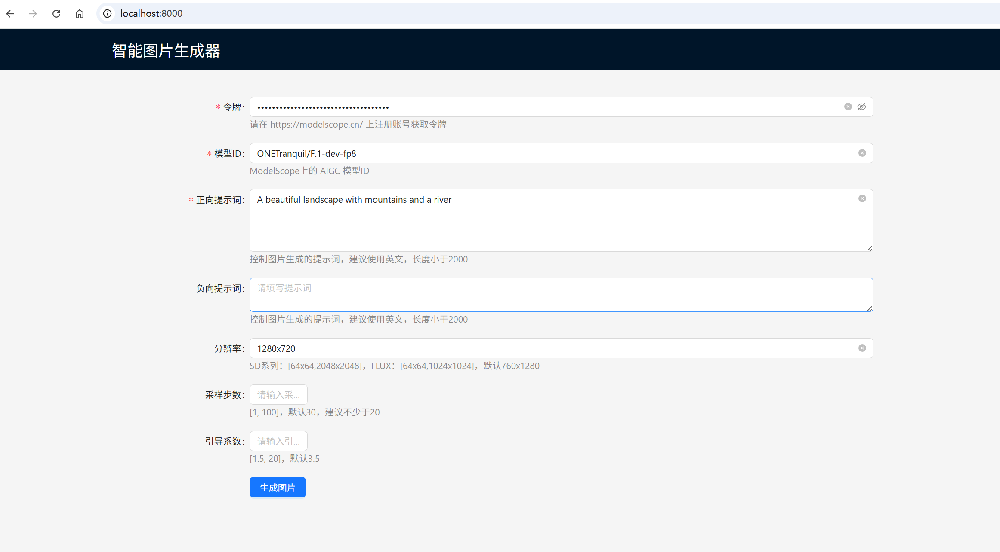
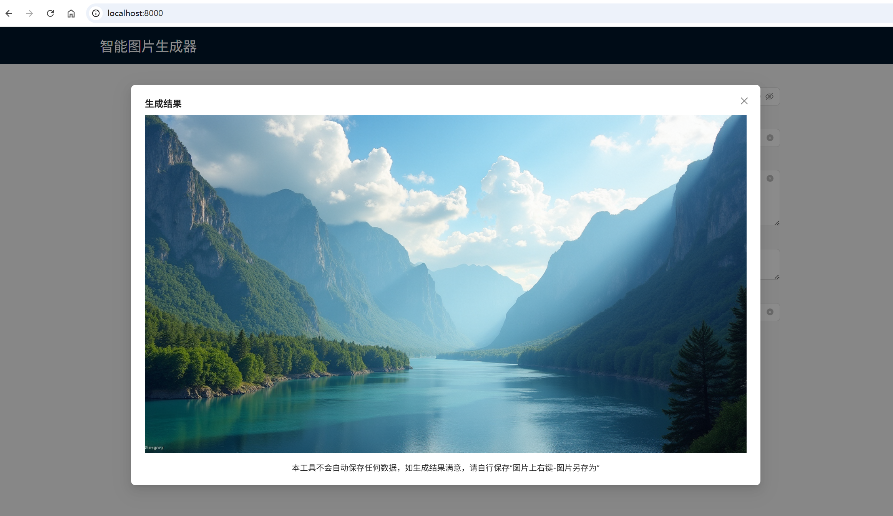

# ai-gen-img
魔搭社区大模型生图API可视化UI

## 运行效果预览



## 环境
本项目使用umi脚手架搭建，使用antd完成界面控件UI。
运行项目前，请先完成本地Node.js运行环境搭建。
安装Node.js：https://nodejs.org/

验证安装结果，检查node命令和npm命令
```bash
node --version

npm --version
```

## 运行
将应用克隆到本地：
```bash
git clone https://github.com/mailzwj/ai-gen-img.git
```
进入项目根目录
```bash
cd ai-gen-img
```
安装运行依赖
```bash
# 国内网络建议安装cnpm
npm i -g cnpm --registry=https://registry.npmmirror.com
# 安装依赖包
cnpm install
```
启动应用
```bash
cnpm start
```
启动成功后，可通过http://localhost:8000访问。

